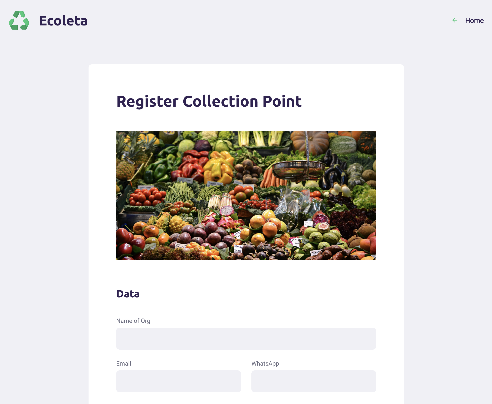

# Ecoleta
Residue collection mobile and web app to allow users find their nearest points of residue collection for recycle as well as allowing organizations register their points.

## Result

### Web App

(Web) Home:

(Web) Residue Collection Point registration

 

(Web) establishment picture upload (Web) establishment picture upload

 

### Mobile App

   

## NextLevelWeek-01
Project built during Next Level Week 01 BootCamp

### Added Value:
1. Migrated Promises to modern JS async/await in useEffect React Hooks
2. Developed for the Android Platform (no expo) [Google API KEYs, Google Fonts, React Native Icons, React Native Mail]
3. Geolocation from '@react-native-community/geolocation';
4. English development

## Technologies Used:

1. Node.js
2. Express.js
3. Typescript
4. React
5. React-Native
6. Google Maps
7. SQLite
8. Leaflet
9. React Router
10. Axios
11. React Icons
12. React Dropzone
13. Google Fonts
14. Celebrate
15. Joi
16. Knex
17. React Native Mail
18. React Navigation
